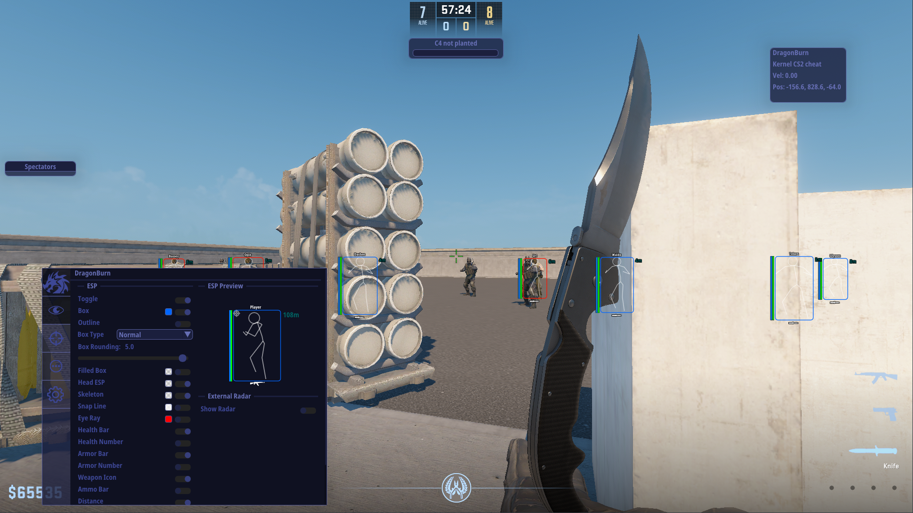
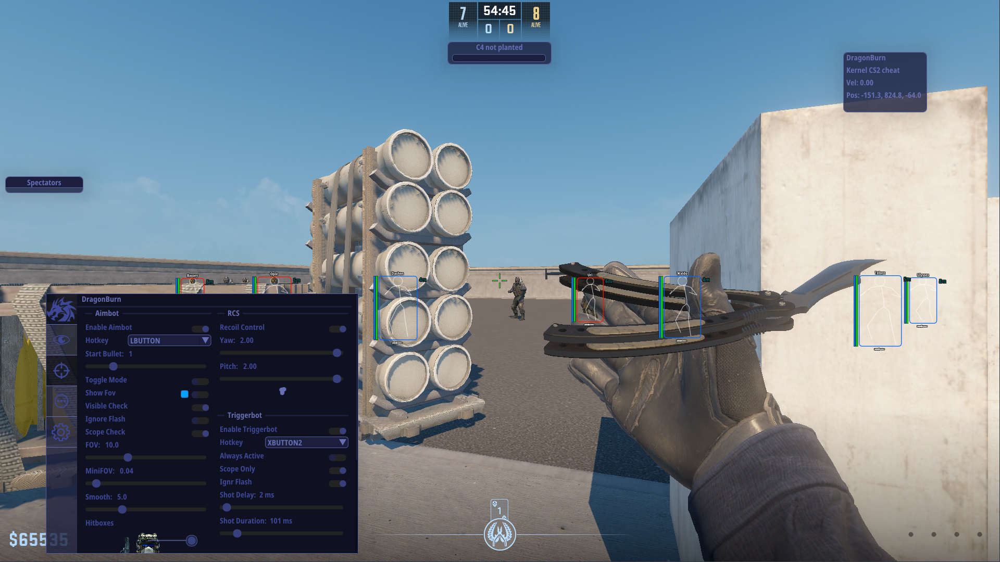

  
  
  
  
  
  
  
  
  
  
  

---
### DragonBurn is one of the best CS2 read only external cheats. It has ton of features, full customization and offsets auto update. Undetected by all anti-cheats except faceit.
⭐Please, star this repo if it was helpful⭐

---
### 🌐Join our community

---
### 📋 Features
Press END key to open/close menu.

Visual

  
- Box ESP
- Filled Box ESP
- Skeleton
- Snap Line
- Eye Ray
- Health Bar
- Armor Bar
- Weapon
- Ammo
- Distance
- Name
- Scoped
- AWP Crosshair
- Visual Preview

Radar Hack

  
- Point Size
- Proportion
- Range
- Alpha

Aimbot

  
- Start Bullet
- Aim Lock
- Draw Fov
- Visible Only
- Ignore Flash
- Scope Only
- Auto Shoot
- FOV
- Smooth
- Multi Hitboxes Selection

RCS

  
- Yaw
- Pitch
- Preview

Trigger Bot

  
- Scope Only
- Ignore Flash
- Shot Delay
- Shot Duration

Misc

  
- Bomb Timer
- Fast Stop
- Head Line
- Hit Sound
- Hit Markers
- Spectator list
- Watermark
- Anti Record

### 🖼️Prewiev

---
